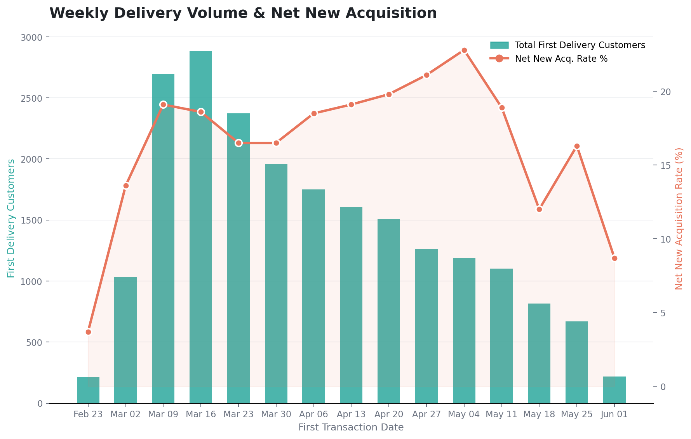
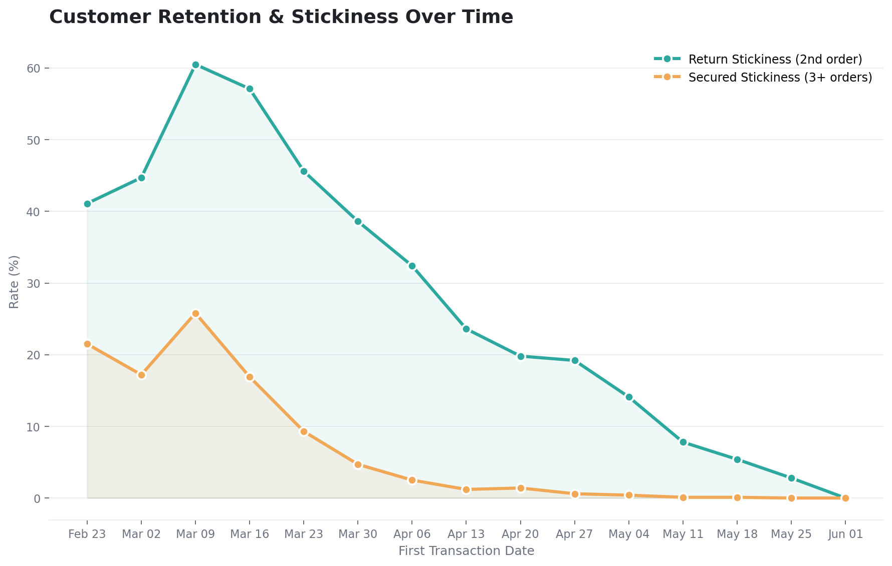
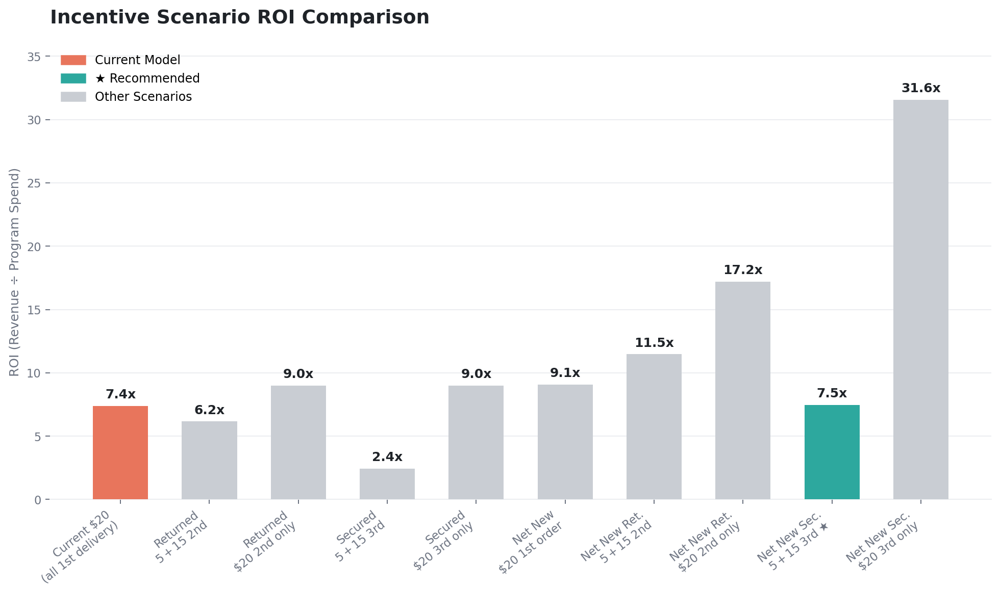
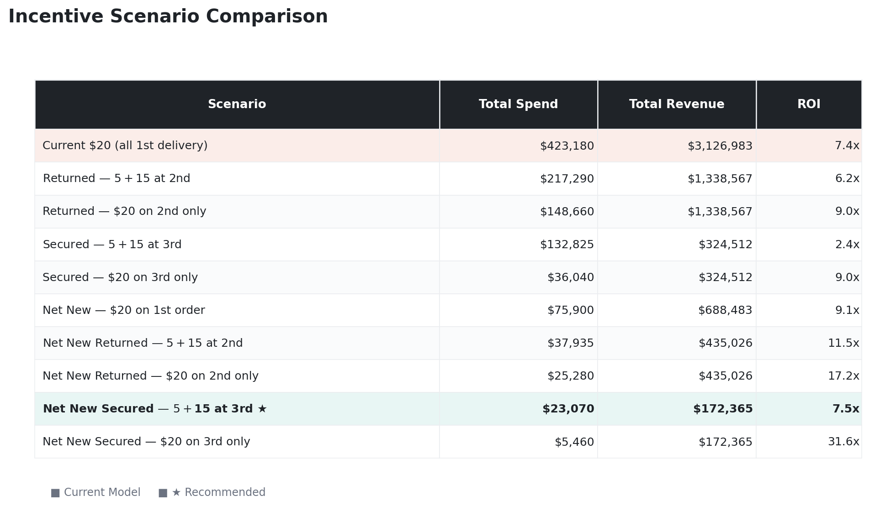

# 📦 SwiftDrop Delivery Program — Incentive Strategy Analysis

**swiftdrop_delivery** — End-to-end analytics case study diagnosing an incentive program's hidden inefficiency and modeling ROI improvements


---

## 🏢 Client Background

**SwiftDrop** is a last-mile consumer delivery platform partnering with specialty retail brands to offer on-demand home delivery to customers. As the platform scales, SwiftDrop launched a **$20 flat-rate new customer incentive program** in Q1 2026 — designed to reward delivery partners for acquiring net new customers and driving repeat delivery engagement.

The business model relies on two levers:
- **Customer acquisition** — bringing new shoppers into the delivery channel
- **Retention** — converting one-time delivery customers into habitual users

This analysis was commissioned to evaluate whether the current incentive structure is achieving both objectives efficiently, and to identify the optimal incentive design for maximizing ROI.

---

## 🎯 North Star Metrics

| Metric | Definition |
|---|---|
| **Net New Acquisition Rate** | % of first-time delivery customers with no prior purchase history |
| **Return Stickiness Rate** | % of first-time delivery customers who return for a 2nd order |
| **Secured Stickiness Rate** | % of first-time delivery customers who reach 3+ orders |
| **Program ROI** | Total delivery revenue ÷ total incentive program spend |
| **Net New Post-Delivery Revenue** | Revenue generated by net new customers after their first delivery |

---

## 📊 Executive Summary

### The Problem

The current **$20 flat incentive for every first-time delivery customer** was designed to drive new customer acquisition. However, post-launch data reveals a structural misalignment: the program is paying for delivery adoption among **existing customers** rather than generating truly new business.

### Key Findings

- **21,159 total first-time delivery customers** since launch — but only **3,795 (18%) are net new** with no prior purchase history
- The net new acquisition rate has **declined from 20–25% at launch to ~15% in recent weeks**
- Of the 3,795 net new customers: **1,264 (33%) returned** for a second delivery order, and only **273 (7%) reached a confirmed habit of 3+ orders**
- The current model carries the **highest program spend at $423,180** with a **7.4x ROI** — the lowest ROI of all modeled scenarios

### The Recommendation

**Net New Secured — $5 at acquisition + $15 at 3rd order**

Adopt the **Net New Secured — $5 at acquisition + $15 at 3rd order** structure. Total spend: $23,070. ROI: 7.5x. This structure preserves vendor motivation with an upfront trigger while tying the larger payout to confirmed durable behavior. This scenario also carries the **second lowest total spend** of all modeled structures while still reaching a meaningfully larger qualifying customer pool than the highest-ROI alternative — making it the stronger choice when broad program reach matters alongside efficiency.

For the marketing team working within a tight budget, the **Net New Secured — $20 on 3rd order only** structure would be the best approach. Total spend: $5,460. ROI: 31.6x — the highest ROI of any scenario modeled, achieved by tying the entire payout to confirmed durable behavior at the 3rd order with no upfront acquisition cost.

> If budget is the primary constraint above all else: **Net New Secured — $20 on 3rd order only** offers the highest ROI at **31.6x** with just $5,460 in spend — though it removes the upfront incentive that motivates vendor acquisition activity.

---

## 📈 Dashboard

### Weekly Delivery Volume & Net New Acquisition


First-time delivery customers peaked in early March 2026 before declining steadily. The net new acquisition rate has remained relatively flat at 15–20%, meaning volume decline is reducing absolute net new customer count without improving the share of truly new customers. The program is not getting more efficient over time.

---

### Customer Retention & Stickiness Over Time


Return stickiness (2nd order) peaked at 60% in the third week of March and has declined sharply to below 20% in recent weeks. Secured stickiness (3+ orders) has followed the same pattern. This is expected as earlier cohorts have had more time to complete repeat orders — but the declining trend in mature cohorts is a signal worth monitoring.

---

### Incentive Scenario ROI Comparison


The current flat $20 model has the lowest ROI (7.4x) of all modeled scenarios. Scenarios that gate incentives behind a 2nd or 3rd order dramatically outperform — with the Net New Secured $20 on 3rd order only scenario reaching 31.6x ROI, driven by a very small qualifying customer pool with high post-delivery revenue per customer.

---

### Incentive Scenario Comparison — Full Detail


The current model carries the highest total spend ($423,180) and the lowest ROI (7.4x) of any scenario modeled. The recommended Net New Secured — $5+$15 at 3rd order structure cuts spend to $23,070 while still capturing meaningful program reach, and the $20-on-3rd-order-only variant delivers the highest capital efficiency available at 31.6x ROI on just $5,460 in spend.

---

## 🗂️ Dataset Structure & ERD

The analysis relies on two core fact tables and one dimension table:

```
┌──────────────────────────────┐
│     dim_customer             │
│──────────────────────────────│
│ customer_group_id   (PK)     │
│ first_retail_txn_date        │
│ acquisition_channel          │
└──────────────┬───────────────┘
               │
       ┌───────┴────────┐
       │                │
┌──────▼──────────┐  ┌──▼────────────────┐
│ fct_transactions │  │ fct_delivery_txns  │
│─────────────────│  │───────────────────│
│ transaction_key  │  │ transaction_key   │
│ customer_grp_id  │  │ customer_grp_id   │
│ transaction_date │  │ transaction_date  │
│ net_sales        │  │ net_sales         │
│ order_made       │  │ order_made = Other│
│ source_name      │  │ source_name       │
└─────────────────┘  └───────────────────┘
```

**Key field definitions:**
- `order_made = 'Other'` → delivery transaction
- `order_made != 'Other'` → in-store / retail transaction
- `source_name NOT IN (excluded_sources)` → filters out partner channels not part of the program
- `customer_type = 'net_new'` → customer whose first-ever transaction was a delivery order (no prior retail history)

---

## 🔍 SQL Framework

The analysis is built on a modular CTE architecture. Each CTE answers one business question:

### CTE 1 — `first_delivery_txn`
Identifies each customer's **first delivery transaction** using QUALIFY + ROW_NUMBER. This anchors the 30-day post-delivery measurement window.

```sql
WITH first_delivery_txn AS (
    SELECT
        customer_group_id,
        transaction_key  AS first_delivery_transaction_key,
        transaction_date AS first_delivery_txn_date,
        net_sales        AS first_delivery_txn_net_sales
    FROM fct_transactions
    WHERE order_made = 'Other'
      AND source_name NOT IN (excluded_sources)
      AND transaction_date > program_launch_date
    QUALIFY ROW_NUMBER() OVER (
        PARTITION BY customer_group_id
        ORDER BY transaction_date, transaction_key
    ) = 1
)
```

### CTE 2 — `all_first_purchase`
Finds each customer's **first transaction of any type** (delivery or retail). Comparing this to `first_delivery_txn_date` determines whether the customer is net new.

```sql
, all_first_purchase AS (
    SELECT
        customer_group_id,
        MIN(transaction_date) AS first_retail_txn_date
    FROM fct_transactions
    WHERE source_name NOT IN (excluded_sources)
    GROUP BY customer_group_id
)
```

### CTE 3 — `post_delivery`
Counts all delivery transactions that occurred **after** the customer's first delivery — measuring return behavior.

```sql
, post_delivery AS (
    SELECT
        fdt.customer_group_id,
        COUNT(DISTINCT dt.transaction_key) AS post_delivery_txns,
        SUM(dt.net_sales)                  AS post_delivery_net_sales
    FROM first_delivery_txn AS fdt
    LEFT JOIN fct_transactions AS dt
        ON fdt.customer_group_id = dt.customer_group_id
        AND dt.order_made = 'Other'
        AND dt.transaction_date > fdt.first_delivery_txn_date
    GROUP BY 1
)
```

### CTE 4 — `customer_base`
Assembles the full customer profile with all behavioral flags — net new classification, return flag, and secured flag.

```sql
, customer_base AS (
    SELECT
        fdt.customer_group_id,
        fdt.first_delivery_txn_date,
        fdt.first_delivery_txn_net_sales,
        af.first_retail_txn_date,
        COALESCE(pd.post_delivery_txns, 0)  AS post_delivery_txns,
        COALESCE(pd.post_delivery_net_sales, 0) AS post_delivery_net_sales,

        CASE
            WHEN af.first_retail_txn_date = fdt.first_delivery_txn_date
            THEN 'net_new' ELSE 'existing'
        END AS customer_type,

        CASE
            WHEN af.first_retail_txn_date = fdt.first_delivery_txn_date
                AND COALESCE(pd.post_delivery_txns, 0) > 0
            THEN 1 ELSE 0
        END AS is_returned_net_new,

        CASE
            WHEN af.first_retail_txn_date = fdt.first_delivery_txn_date
                AND COALESCE(pd.post_delivery_txns, 0) > 3
            THEN 1 ELSE 0
        END AS is_secured_net_new

    FROM first_delivery_txn AS fdt
    LEFT JOIN all_first_purchase AS af ON fdt.customer_group_id = af.customer_group_id
    LEFT JOIN post_delivery AS pd      ON fdt.customer_group_id = pd.customer_group_id
)
```

---

## 🔬 Insight Deep Dive

### 1. Net New Acquisition Is Declining

Since launch, the program's ability to attract genuinely new customers has weakened. The net new acquisition rate opened at 20–25% and has trended down to approximately 15% in recent weeks. With total weekly first-time delivery volume also declining, fewer than 1,000 truly net new customers are being acquired per week — a significant gap relative to the 21,159 total customers the program has touched.

**Insight:** The current $20 flat incentive is not differentiating between new-to-brand and new-to-delivery customers. Delivery partners have little financial motivation to seek out brand-new customers specifically, because the payout is the same regardless. Without a structure that rewards net new acquisition differently, this rate is unlikely to recover.

**Recommendation:** Introduce a net new differentiation gate. Even a modest $5 upfront incentive specifically for net new customers — versus no upfront incentive for existing customers choosing delivery for the first time — creates a meaningful signal to delivery partners about where to focus acquisition energy.

---

### 2. Return Stickiness Is Heavily Cohort-Dependent

The return stickiness rate (customers who place a 2nd delivery order) peaked at 60% in the earliest cohorts and has declined sharply in more recent weeks. This is partially a maturity effect — newer cohorts have had less time to return. However, even controlling for cohort age, the absolute return rate of 33% for net new customers is lower than optimal for a program seeking to build delivery habits.

**Insight:** One in three net new customers comes back. That is a reasonable starting point but not a strong enough foundation to justify a flat $20 payout regardless of whether a customer returns. The current structure pays the same whether a customer orders once and never returns or becomes a loyal delivery user.

**Recommendation:** Introduce a behavioral gate. Splitting the incentive into acquisition + stickiness (e.g., $5 at first order + $15 at second order) ties the majority of the payout to demonstrated return behavior, reducing program spend on one-and-done customers while preserving the full incentive for those who stick.

---

### 3. Secured Customers Are the Highest-Value Segment

Only 273 net new customers (7% of the net new pool) have reached a confirmed delivery habit of 3+ orders — but they represent a disproportionate share of post-delivery net sales. The Net New Secured scenario generates $148,416 in post-delivery net sales from just 273 customers — a post-delivery ATV consistently in the $75–90 range across cohorts.

**Insight:** Securing a delivery habit requires more than two touchpoints. Customers who reach a third order have demonstrated true behavioral change — these are the customers worth investing in fully. The 3rd-order gate filters out customers who were trying delivery opportunistically and focuses program spend on those with genuine long-term value.

**Recommendation:** The Net New Secured — $5 + $15 split at 3rd order preserves acquisition incentive while focusing the larger payout on confirmed long-term value, at a total spend of $23,070 and 7.5x ROI. For teams prioritizing maximum capital efficiency above reach, the Net New Secured — $20 on 3rd order only scenario delivers the highest ROI available at 31.6x with just $5,460 in total program spend.

---

### 4. The Current Model Is the Least Efficient

At $423,180 in total program spend and a 7.4x ROI, the current flat $20 model is simultaneously the most expensive and least efficient structure in the analysis. It pays for 21,159 customers regardless of whether they are net new, regardless of whether they return, and regardless of whether delivery becomes a habit.

**Insight:** The program's design assumes that all first-time delivery customers are equally valuable. The data shows they are not. Net new customers, returned customers, and secured customers each represent materially different levels of value — and the current structure does not distinguish between them.

**Recommendation:** Any restructuring — regardless of which scenario is chosen — will improve ROI over the current model. The Net New Secured — $5 + $15 at 3rd order structure offers the strongest balance of efficiency and program reach at $23,070 in spend and 7.5x ROI.

---

## 💡 Key Takeaways

1. **18% of first-time delivery customers are net new** — the program is primarily serving existing customers
2. **Net new acquisition rate is declining** from 20–25% at launch to ~15% in recent weeks
3. **Only 7% of net new customers reach 3+ orders** — the threshold for confirmed delivery habit
4. **The current $20 flat model has the lowest ROI (7.4x)** of all modeled scenarios
5. **The recommended scenario** (Net New Secured — $5 + $15 at 3rd order) costs $23,070 and delivers 7.5x ROI with built-in acquisition motivation
6. **The highest ROI scenario** (Net New Secured — $20 on 3rd order only) delivers 31.6x ROI at $5,460 spend, but removes upfront vendor acquisition incentive

---

## 🛠️ Tools & Methods

- **SQL (Snowflake)** — CTE-based behavioral segmentation, QUALIFY + ROW_NUMBER for first-event identification, COALESCE for null handling
- **Python (pandas, matplotlib)** — data cleaning, aggregation, and executive dashboard visualization
- **Excel** — scenario modeling and stakeholder-ready output
- **dbt** — underlying data transformation layer for transaction and customer models

---

*This analysis was developed as a job scenario exercise to demonstrate end-to-end analytical thinking — from ambiguous business problem to executive-ready recommendation.*

**Abigail Ezedonmwen** · linkedin.com/in/abigailezed · abigailezed@gmail.com
